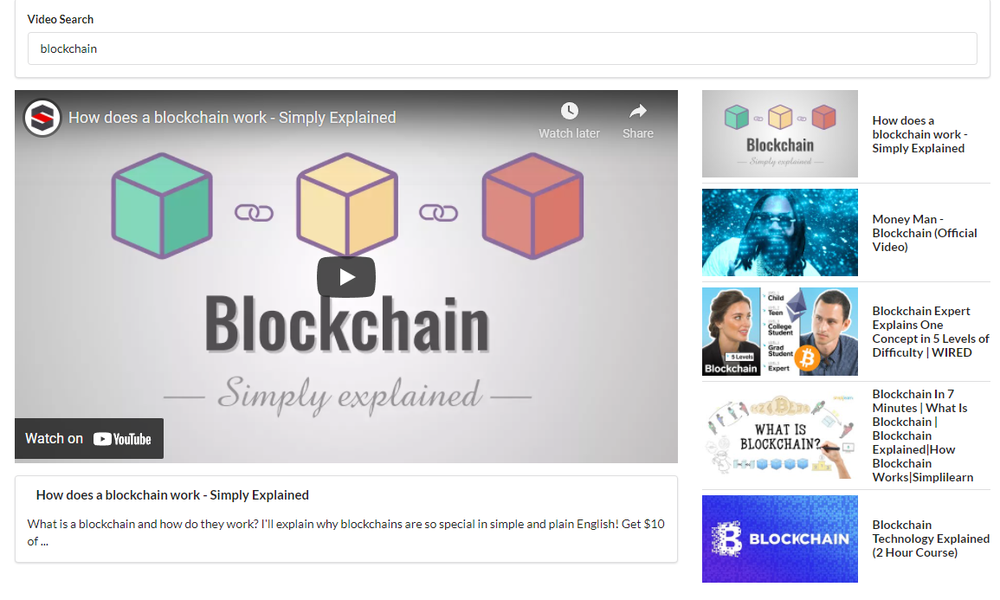

# Frontend

The app consists of five components: 
1. **App** for main render. 
2. **SearchBar** to send a query to the API. 
3. **VideoDetail** for getting information about the video search. 
4. **VideoList** to pull in 5 videos relevant to search query. 
5. **VideoItem** for displaying the first video in the VideoList.

